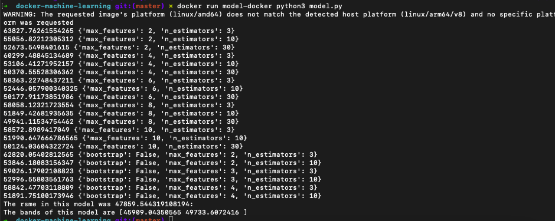

# docker-machine-learning
Build and Run a Docker Container for Machine Learning Model


Principal goal : Build Docker Container (MLops) with a regression ML model (Random Forest) and run it.

Principal Files :

* Dockerfile 

```{docker}
FROM jupyter/scipy-notebook
```

* utils.py

```{python}
def pipelines(data):
    cat_encoder = OneHotEncoder(sparse=False)

    housing_cat = data[['ocean_proximity']]
    housing_cat_1hot = cat_encoder.fit_transform(housing_cat)
    housing_num = data.drop('ocean_proximity', axis=1)
    ordinal_encoder = OrdinalEncoder()
    housing_cat_encoded = ordinal_encoder.fit_transform(housing_cat)

    num_attribs = list(housing_num)
    cat_attribs = ["ocean_proximity"]


    num_pipeline = Pipeline([
            ('imputer', SimpleImputer(strategy="median")),
            ('std_scaler', StandardScaler()),
        ])

    full_pipeline = ColumnTransformer([
            ("num", num_pipeline, num_attribs),
            ("cat", OneHotEncoder(), cat_attribs),
        ])

    housing_prepared = full_pipeline.fit_transform(data)
    
    return housing_prepared 
```

* model.py

```{python}
forest_reg = RandomForestRegressor(random_state=42)

grid_search = GridSearchCV(forest_reg, param_grid, cv=5,
                           scoring='neg_mean_squared_error', return_train_score=True)
grid_search.fit(housing_prepared, housing_labels)

cvres = grid_search.cv_results_
for mean_score, params in zip(cvres["mean_test_score"], cvres["params"]):
    print(np.sqrt(-mean_score), params)


```

The model.py is a python script that ingest and pre-processing data (in batch)

Biuling image 

```{docker}
docker buidl -t docker-model -f Dockerfile .

```

For running :

```{docker}
docker run docker-model python3 model.py
```

Output

